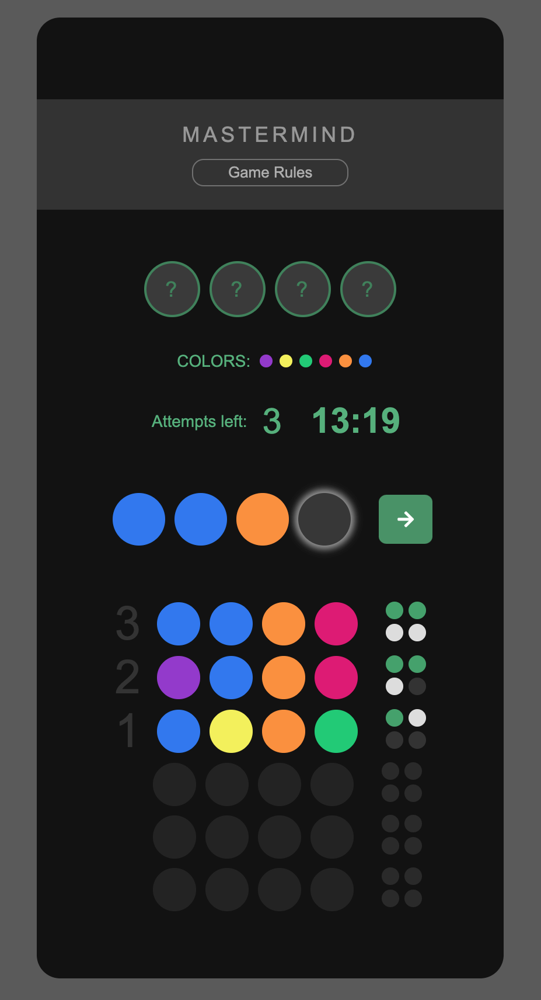

# Mastermind game

live site link:
https://dariasidorko.github.io/mastermind-game/

# About The Project

## Getting Started
Those instructions will help you to install and run the game on your local device.

## Built With

JavaScript 
HTML5 - DOM
CSS 

## Installation

you will need:
git: (https://git-scm.com/downloads)

To clone this project onto your devise, copy the following line into your terminal. 
* Dont forget to choose proper directory to clone to.

git clone https://github.com/DariaSidorko/mastermind-game.git

Get a free API Key at https://example.com
Clone the repo
git clone https://github.com/your_username_/Project-Name.git

* to run the game, right click on Index.html and pick the browser of your choice.

## Game Features

- Player against the computer game.
  Hardness levels:
- Can choose a number of attempts.
- Can choose to have a timer in the game.

For detailed game rules refer to in game guide.

* The wall of fame is currently under development. Need to build an API to implement it.

## Contributing

If you have a suggestion that would make this better, please fork the repo and create a pull request or open an issue with the tag "enhancement".

1. Fork the Project
2. Create your Feature Branch (git checkout -b feature/AmazingFeature)
3. Commit your Changes (git commit -m 'Add some AmazingFeature')
4. Push to the Branch (git push origin feature/AmazingFeature)
5. Open a Pull Request

## Contact

Project Link: https://github.com/DariaSidorko/mastermind-game.git

## Acknowledgments

GitHub Pages
Font Awesome

## License

MIT © DariaSidorko